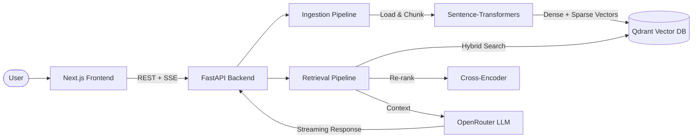

# IntelliDocs

**Intelligent Document Understanding & Retrieval** — a production-ready RAG system that transforms document collections into a queryable knowledge base.

Upload documents in any format. Ask questions in natural language. Get accurate, source-cited answers.

---

## Architecture



---

## Features

- **Multi-format ingestion** — PDF, DOCX, TXT, Markdown, CSV with automatic metadata extraction
- **Hybrid retrieval** — Dense (sentence-transformers) + sparse (BM25) search for better recall
- **Cross-encoder re-ranking** — Two-stage recall-then-rerank pipeline for precision
- **Streaming chat** — Server-Sent Events for real-time, token-by-token responses
- **Source citations** — Every answer links back to the document chunks that informed it
- **Configurable LLM** — Any model available on OpenRouter (GPT-4o, Llama, Mistral, etc.)
- **Modern frontend** — Next.js 16 with Tailwind CSS and Framer Motion animations
- **Docker-ready** — One command to spin up the full stack (Qdrant + Backend + Frontend)
- **Dual vector store** — Qdrant (production) or ChromaDB (lightweight fallback)
- **Conversation memory** — Multi-turn chat with context-aware follow-up questions

---

## Quick Start

```bash
# 1. Clone the repository
git clone https://github.com/UDICA/intellidocs.git
cd intellidocs

# 2. Configure environment
cp .env.example .env
# Edit .env and add your OpenRouter API key

# 3. Launch everything
docker-compose up --build
```

Open [http://localhost:3000](http://localhost:3000) — upload documents and start querying.

---

## Local Development

### Prerequisites

- Python 3.11+
- Node.js 20+
- [uv](https://docs.astral.sh/uv/) (recommended) or pip
- Docker (for Qdrant) or use ChromaDB in-memory

### Backend

```bash
# Install dependencies
uv pip install -e ".[dev]"

# Start Qdrant (or set VECTOR_STORE_BACKEND=chroma to skip)
docker run -d -p 6333:6333 qdrant/qdrant

# Run the API server
uvicorn backend.src.main:app --reload --port 8000
```

### Frontend

```bash
cd frontend
npm install
npm run dev
```

Open [http://localhost:3000](http://localhost:3000).

### Ingest Sample Documents

```bash
python -m backend.src.cli data/sample_docs/
```

---

## Configuration

All settings are controlled via environment variables or a `.env` file.

| Variable | Default | Description |
|----------|---------|-------------|
| `OPENROUTER_API_KEY` | — | API key for OpenRouter (required for LLM generation) |
| `OPENROUTER_MODEL` | `anthropic/claude-haiku-4.5` | LLM model identifier (any OpenRouter-supported model) |
| `EMBEDDING_MODEL` | `all-MiniLM-L6-v2` | Sentence-transformers model for embeddings |
| `RERANKER_MODEL` | `cross-encoder/ms-marco-MiniLM-L-6-v2` | Cross-encoder model for re-ranking |
| `QDRANT_HOST` | `localhost` | Qdrant server hostname |
| `QDRANT_PORT` | `6333` | Qdrant server port |
| `QDRANT_COLLECTION` | `intellidocs` | Qdrant collection name |
| `VECTOR_STORE_BACKEND` | `qdrant` | Vector store backend: `qdrant` or `chroma` |
| `CHUNK_SIZE` | `512` | Maximum chunk size in characters |
| `CHUNK_OVERLAP` | `50` | Overlap between consecutive chunks |
| `TOP_K` | `5` | Number of documents to retrieve |
| `SIMILARITY_THRESHOLD` | `0.3` | Minimum similarity score for retrieval |

---

## How It Works

IntelliDocs implements a **Retrieval-Augmented Generation (RAG)** pipeline in two stages:

### 1. Ingestion

Documents are loaded, split into overlapping chunks, and embedded into both dense (sentence-transformers) and sparse (BM25) vector representations. These vectors are stored in Qdrant alongside the original text and metadata (source file, page number, chunk index).

### 2. Query

When a user asks a question:

1. **Embed** — The query is encoded into dense and sparse vectors using the same embedding model
2. **Retrieve** — Hybrid search (dense + sparse) fetches an initial candidate set from Qdrant, over-fetching by 3x to ensure good recall
3. **Re-rank** — A cross-encoder scores each (query, candidate) pair jointly, producing far more accurate relevance estimates than bi-encoder similarity alone
4. **Generate** — The top-k re-ranked chunks are injected into a prompt and sent to the LLM via OpenRouter, which streams the response token-by-token back to the user

This two-stage **recall-then-rerank** pattern balances the speed of bi-encoder retrieval with the accuracy of cross-encoder scoring.

---

## Tech Stack

| Layer | Technology |
|-------|------------|
| **Frontend** | Next.js 16, React 19, Tailwind CSS, Framer Motion |
| **Backend** | FastAPI, Pydantic, uvicorn, structlog |
| **Embeddings** | sentence-transformers (`all-MiniLM-L6-v2`) |
| **Re-ranking** | cross-encoder (`ms-marco-MiniLM-L-6-v2`) |
| **Vector Store** | Qdrant (primary), ChromaDB (fallback) |
| **Sparse Search** | rank-bm25 |
| **LLM** | OpenRouter (any supported model) |
| **Document Parsing** | pypdf, python-docx, unstructured |
| **Containerization** | Docker, docker-compose |
| **Testing** | pytest, pytest-asyncio |
| **Linting** | Ruff |

---

## Project Structure

```
intellidocs/
├── backend/
│   ├── Dockerfile
│   ├── src/
│   │   ├── config.py              # Pydantic-settings configuration
│   │   ├── main.py                # FastAPI application entry point
│   │   ├── cli.py                 # CLI for bulk document ingestion
│   │   ├── api/
│   │   │   ├── deps.py            # Dependency injection
│   │   │   └── routes/            # Health, documents, chat endpoints
│   │   ├── ingestion/
│   │   │   ├── loader.py          # Multi-format document loader
│   │   │   ├── chunker.py         # Recursive character text splitter
│   │   │   └── processor.py       # Ingestion pipeline orchestrator
│   │   ├── embeddings/
│   │   │   └── embedder.py        # Dense + sparse embedding wrapper
│   │   ├── vectorstore/
│   │   │   ├── base.py            # Abstract base class
│   │   │   ├── qdrant_store.py    # Qdrant implementation
│   │   │   └── chroma_store.py    # ChromaDB fallback
│   │   ├── retrieval/
│   │   │   ├── retriever.py       # Hybrid retrieval (dense + sparse)
│   │   │   └── reranker.py        # Cross-encoder re-ranking
│   │   └── generation/
│   │       ├── llm_client.py      # OpenRouter streaming client
│   │       ├── prompts.py         # Prompt templates with citations
│   │       └── rag_chain.py       # RAG chain orchestration
│   └── tests/
├── frontend/
│   ├── Dockerfile
│   └── src/                       # Next.js application
├── data/
│   └── sample_docs/               # Sample documents for demo
├── docs/
│   └── architecture.md            # Detailed architecture documentation
├── docker-compose.yml             # Full stack: Qdrant + Backend + Frontend
├── pyproject.toml
└── .env.example
```

---

## License

[MIT](LICENSE)
